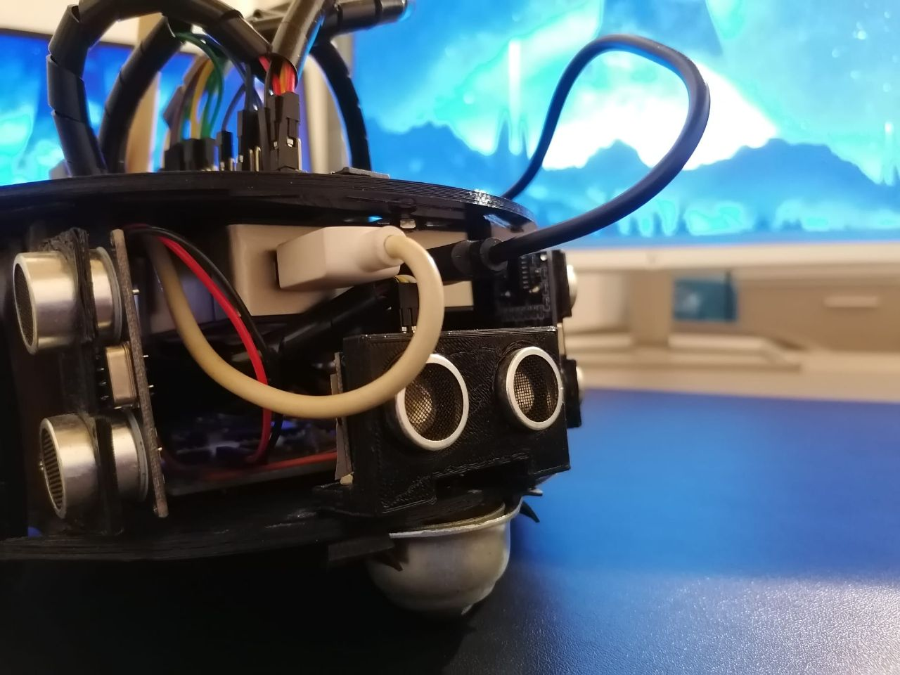

# Amerigo-2.0

<h3>Autori</h3>

<b> Davide Nunzio Maccarrone Mat: 0000850912 davide.maccarrone@studio.unibo.it </b> 
<b> Bruno Quintero Panaro Mat: 0000843825 bruno.quinteropanaro@studio.unibo.it </b>

<h3>Il progetto</h3>

Amerigo 2.0 è un robot in grado di perseguire una rotta definita gestendo eventuali ostacoli presenti sul suo cammino. La gestione degli ostacoli è stata implementata mediante una versione di algoritmo BUG realizzata ad hoc per l'hardware di cui Amerigo 2.0 dispone.

Il software è stato sviluppato utilizzando il linguaggio Python e diverse librerie per l'interazione hardware a basso livello. Amerigo 2.0 è dotato, inoltre, di un sistema di mapping degli ostacoli individuati. Esso, mediante le diverse misurazioni effettuate dai sensori di prossimità, è capace di registrare e rappresentare dati riguardanti gli ostacoli incontrati sul suo cammino e dati circa gli spostamenti effettuati.

Per altri dettagli si rimanda alla documentazione presente su questa repository.

<h3>Software</h3>

E' possibile eseguire il software in due modalità:

Modalità senza mapping degli ostacoli  
<code>
python start.py
</code>

#Modalità con mapping degli ostacoli  
<code>
python start.py map
</code>

La modalità con mapping effettuerà, al termine dello script, il plotting degli eventuali ostacoli rilevati e degli spostamenti effettuati dal robot per aggirarli.

<h3>Utilizzo</h3>
E' concesso qualsiasi tipo di utilizzo e/o modifica al presente software, purchè vengano citati gli autori e la fonte alla presente repository.
